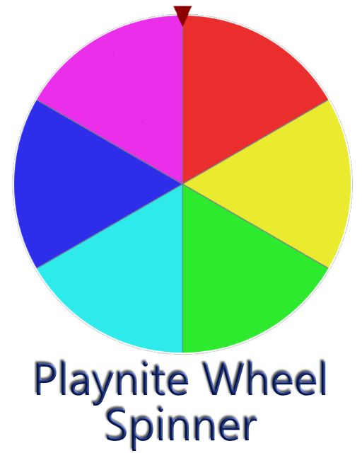
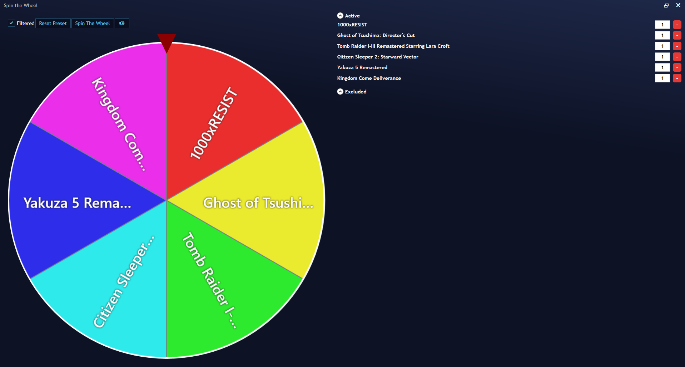



    <picture>   
        <source
        media="(prefers-color-scheme: dark)"
        srcset="Images/logo_dark.png">
        <source
        media="(prefers-color-scheme: light)"
        srcset="Images/logo_light.png">
        
    </picture>

### Playnite Wheel Spinner Plugin is a plugin that allows you to get a random game from your collection.

Playnite Wheel Spinner features include:
* Random Game Selection
* Changing Speed in Settings
* Modifying the Weight of Each Game
* Manually Excluding Games from the Random Selection
* Spinning Sound
* Theme Support

# Installation
Download the latest release from the [releases page](https://github.com/Matlej44/WheelSpinnerPlaynite/releases/latest) and drag it into your Playnite window.

# Planned Features

* Localization support
* Customizable spinning sound
* Improving performance by moving to listbox instead of gridview
* Idle wheel spinning animation
